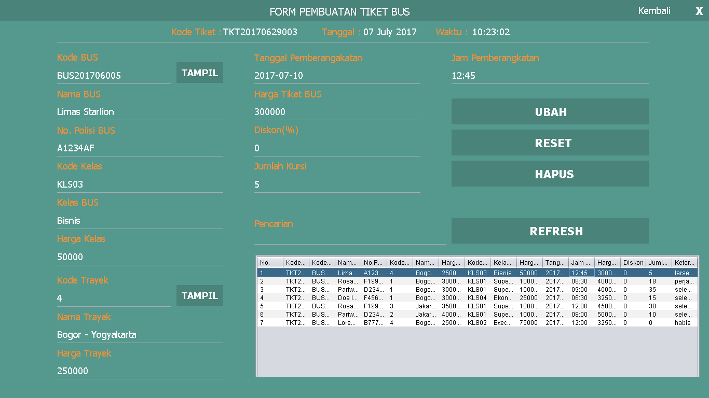
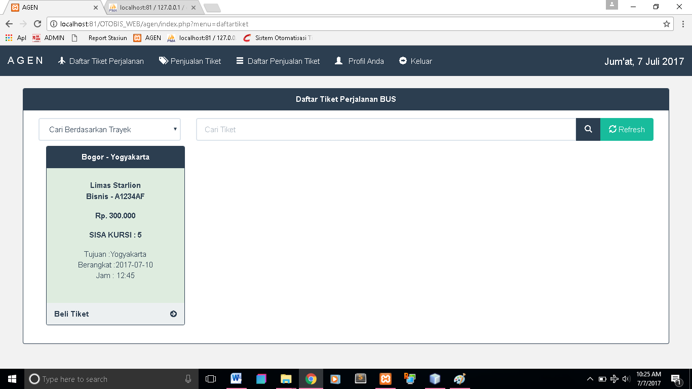
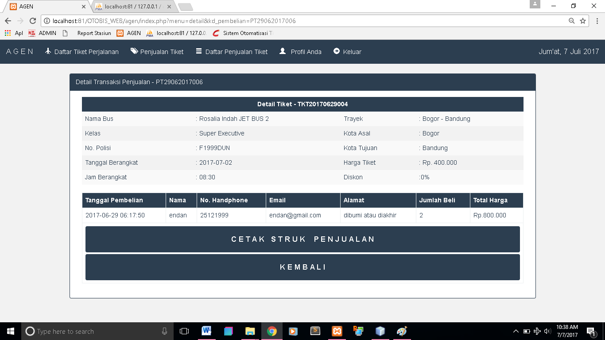
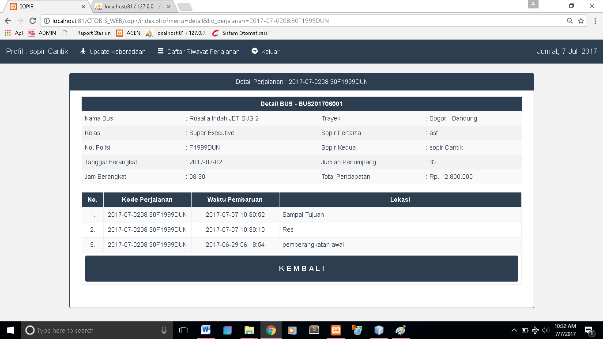

# Aplikasi Pengelola PO BUS
Sebuah aplikasi berbasis web dan desktop untuk mengelola pembuatan tiket, penjualan tiket dan laporan perjalanan bus.

## Fitur
* Pembuatan Tiket Pada Desktop

* Daftar Tiket pada Web

* Penjualan Tiket pada Web

* Laporan Perjalanan Bus


## Teknologi
* PHP 5
* MySQL
* HTML
* CSS
* Javascript
* Bootstrap 
* Java

## Info Developer
Jika ada pertanyaan bisa hubungi kontak dibawah : 
* [Email](mailto:programzidun@gmail.com) - programzidun@gmail.com
* [LinkedIn](https://www.linkedin.com/in/ramdanzidun/) - Muhammad Ramdan
* [Instagram](https://www.instagram.com/ramdanzidun/) - @ramdanzidun


```
Ku Coding Kau dengan Bismillah
```

